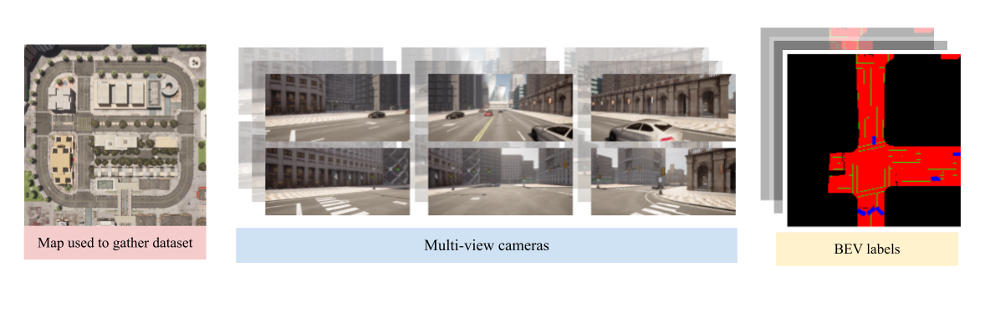

## Check out my projects!

<h3 style="display:inline" markdown="1">CARLA Collector [[github]](https://github.com/bluffish/carla_collector)</h3>

**A project that easily synthesizes autonomous driving datasets**. Uses the driving simulator, [CARLA](https://github.com/carla-simulator/carla).

**Features**
* Gathers multi-modal sensor data from surrounding cameras, LiDAR, and radar.
* Gathers labels such as the position of 3D objects, ground-truth segmentation and depth, and a BEV map.
* Several maps, models of vehicles, and weather conditions
* Inbuilt episode control system

**Used to gather a dataset for papers**
* _Evaluating Uncertainty Quantification for Bird’s Eye View Semantic Segmentation_ (Yang et al)
* _Uncertainty-Focused Semantic Segmentation in BEV for Autonomous Systems: Methods and Benchmarks_ (Lin et al)

---

<h3 style="display:inline" markdown="1">U-BEV [[github]](https://github.com/bluffish/ubev)</h3>

**Description not added yet**

---

